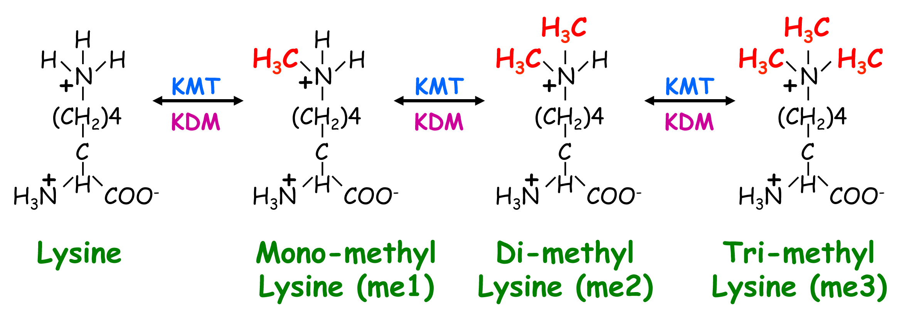
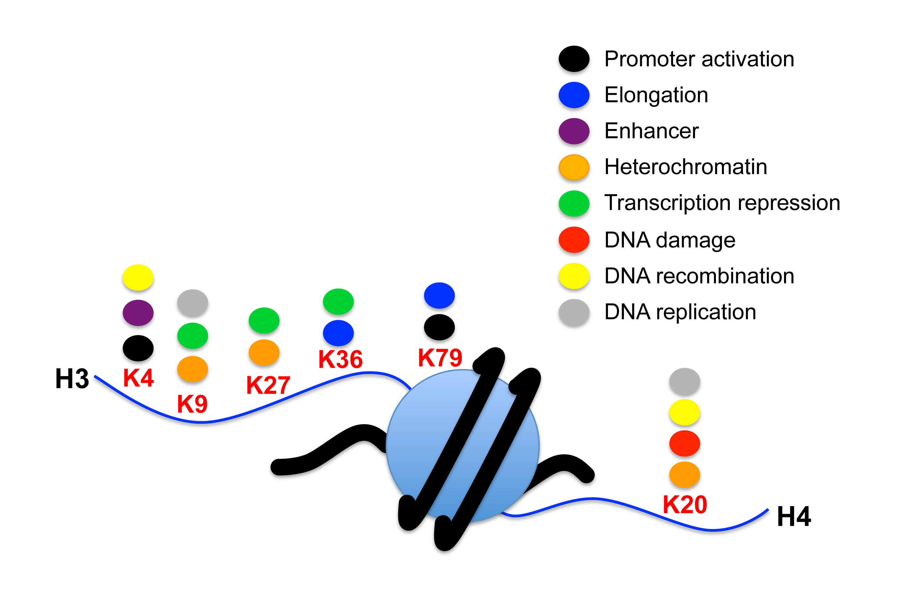
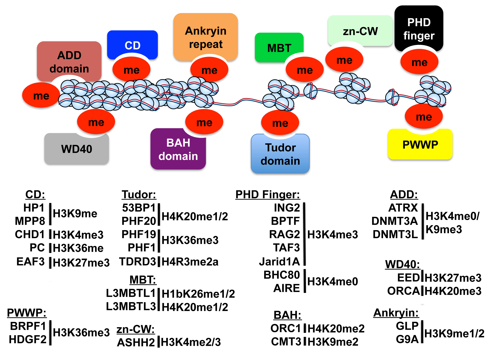

Our laboratory is interested in understanding the molecular mechanisms by which chromatin signaling networks effect nuclear and epigenetic programs, and how disruption in these mechanisms contribute to cancer and other pathologic states.  Our work centers on the biology of protein lysine methylation, a principal chromatin-regulatory mechanism thought to be involved in directing epigenetic processes.  We study how lysine methylation events on histone and non-histone nuclear factors are generated, sensed, and transduced, and how these chemical marks integrate with other modification and nuclear signaling systems to govern diverse functions.

**Major research efforts in the lab include:**

- To investigate the role of histone methylation in regulating chromatin-templated processes including gene expression, DNA replication, and DNA repair

- To uncover the catalytic and biological functions of lysine methyltransferase (KMT) enzymes and understand their role in human disease

- To identify and functionally characterize the molecular mechanism of methyl lysine signaling on histone and non-histone proteins.

- To elucidate new roles for methyl lysine on non-histone proteins

- To develop proteomic and chemical methods, tools, reagents, and technologies to study the biology and pathology of methyl lysine

### Background

A highly complex molecular network at chromatin regulates eukaryotes genomes, with all DNA-templated processes being fundamentally affected by chromatin structure and dynamics. One of the major mechanisms for chromatin regulation involves the reversible covalent post-translational modification of histone proteins by chemical moieties such as acetyl-, methyl- and phospho- groups.  These different histone modifications are linked to discrete chromatin states and are thought to regulate the extent of accessibility of DNA to transacting factors. Of the various histone modification systems, histone methylation is the most diverse with respect to the number of residues targeted for modification, potential for signaling, and biological functions regulated.

Histones can be reversibly methylated on the nitrogen side-chain of lysine residues.  This process, while subtly changing the primary structure of a peptide, greatly increases the information encoded within the molecule. Lysine residues can accept up to three methyl groups, forming mono-, di-, and trimethylated derivatives, with a unique activity frequently being coupled to the specific extent of methylation on the lysine residue.

There are a large number of enzymes that catalyze the addition (often referred to as “writers”) or removal (referred to as “erasers”) of specific histone methylation events. At the molecular level, the addition of a methyl moiety to a protein serves as a signal to directly regulate modular protein-protein interactions. In this context, the proteins and domains that recognize distinct histone methylation events, often referred to as “readers” or “effectors”, are postulated to define the functional consequences of specific modifications by transducing molecular events at chromatin to distinct biological outcomes. Indeed, histone methylation has been clearly linked through specific reader proteins to fundamental DNA-templated processes, including transcriptional activation and repression, DNA repair, DNA recombination, DNA replication, and chromosome segregation. The methylation of histones has also been shown to be a critical mechanism employed for the regulation of epigenetic processes, and deregulation in histone methylation dynamics is clearly implicated in human diseases ranging from cancer and aging to disorders of developmental and cognitive function.

<!-- note the extra spaces below for the caption to render properly -->

### Progress to-date

We have generated an expression library containing the majority of the greater than fifty protein lysine methyltransferase (KMT) enzymes predicted to be present in the human proteome.  While several of these enzymes have been implicated in human disease, the catalytic activity and substrate specificity for many of these enzymes and how such activities relate to disease pathogenesis, is presently not clear. We are conducting studies employing molecular, biochemical, genomic, and cellular strategies to understand the physiologic and pathologic action for several of these factors, with an emphasis on KMTs implicated in cancer, infections disease, and immunological diseases.

Elucidation of the protein modules present within chromatin-regulatory factors that recognize the broad spectrum of post-translational modifications present on histone proteins is critical for understanding how chromatin dynamics influence fundamental nuclear processes. The PHD finger is an evolutionarily conserved zinc finger motif common to chromatin-associated proteins, and mutations within PHD fingers of many proteins are associated with cancers and genetic disorders.  We have discovered that the PHD finger present in the tumor suppressor ING2 [[Full Text PDF](docs/ING2-PHD-domain-links-histone-H3-lysine-41.pdf)] as well as several other PHD fingers [[Full Text PDF](docs/Proteome-wide-Analysis-in-Saccharomyces.pdf); [Full Text PDF](docs/Hung_ING4_transformation.pdf)] found on diverse nuclear proteins, including the recombinase RAG2 (in collaboration with the Oettinger lab) [[Full Text PDF](docs/Hung_ING4_transformation.pdf)], function as highly selective recognition modules for histone H3 trimethylated at lysine 4 (H3K4me3).  These studies, in conjunction with work from several other groups, have demonstrated that PHD finger constitute the largest known class of chromatin effectors to date and have uncovered new paradigms of how histone methylation impacts on biology.  We utilize a number of approaches to identify and characterize new effector domains that modulate chromatin dynamics to influence key nuclear programs. For example, we pioneered a modified peptide array platform for discovery of new methyllsyine-binding domains, which in collaboration with the lab of Dr. Dinshaw Patel, led to the recent discovery that the BAH (Bromo Adjacent Homology) domain of ORC1 links dimethylation of H4K20 to DNA replication licensing and primordial dwarfism. An example of some of the known methyl lysine-binding domains and their binding partners is shown below:

In addition to histone proteins, several other proteins undergo lysine methylation (for example, p53) indicating that this modification may be a common mechanism for modulating protein-protein interactions and signaling pathways.  We are utilizing a combination of biochemical and proteomic strategies to purify and identify non-histone chromatin-regulatory proteins that are modified by lysine methylation.  We then employ strategies and principles developed for the study of histone methylation to understand the enzymes, effectors, and signaling networks that are linked to these diverse methylation events.
